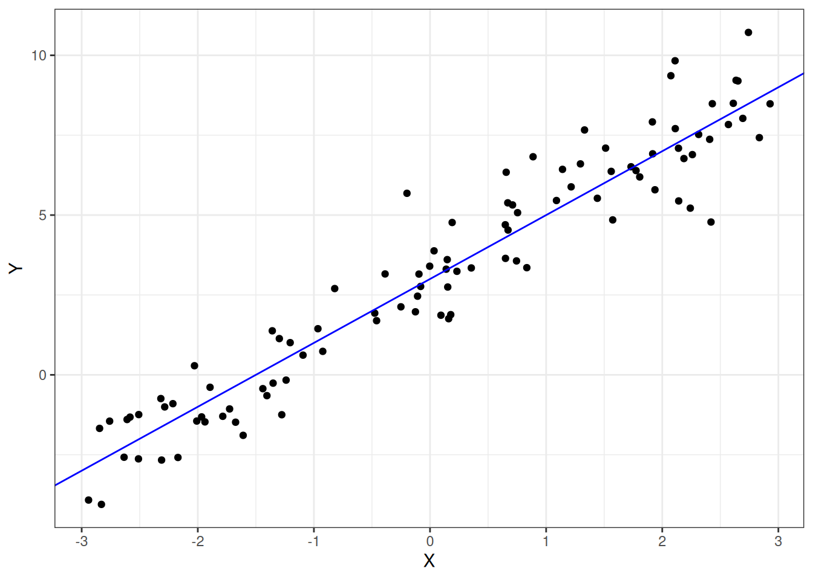
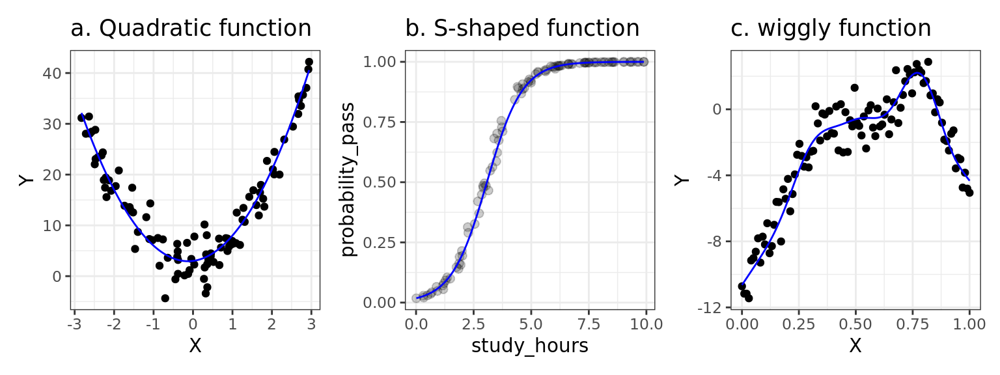

# Introduction


## Goal of this course

The goal of this course is to teach you how to analyze (and simulate!) various types of datasets you are likely to encounter as a psychologist. The focus is on behavioral data usually collected in the context of a planned study or experiment—response time, perceptual judgments, choices, decisions, Likert ratings, eye movements, hours of sleep, etc.

The course attempts to teach analytical techniques that are **flexible**, **generalizabile**, and **reproducible**. The techniques you will learn are flexible in the sense they can be applied to a wide variety of study designs and different types of data. They are maximally generalizable by attempting to fully account for the potential biasing influence of sampling on statistical inference—that is, they help support claims that go beyond the particular participants and stimuli involved in an experiment. Finally, the approach you will learn strives to be fully reproducible, inasmuch as your analyses will unambiguously document every single step in the transformation of raw data into research results in a plain-text script using R code.

## Generalized Linear Mixed-Effects Models (GLMMs)

This course emphasizes a flexible regression modeling framework rather than teaching 'recipes' for dealing with different types of data, and assumes that the fundamental type of data you will need to analyze will be <a class='glossary' target='_blank' title='(or multi-level) Relating to datasets where there are multiple observations taken on the same variable on the same sampling units (usually subjects or stimuli).' href='https://psyteachr.github.io/glossary/m#multilevel'>multilevel</a> and also that you will need to deal not only with continuous measurements but also ordinal measurements (ratings on a Likert scale), counts (number of times particular event types have taken place), and nominal data (what category something falls into).

By the end of this course, you will have learned how to use Generalized Linear Mixed-Effects Models (GLMMs) to quantify the relationships between a <a class='glossary' target='_blank' title='The target variable that is being analyzed, whose value is assumed to depend on other variables.' href='https://psyteachr.github.io/glossary/d#dependent-variable'>dependent variable</a> and a set of <a class='glossary' target='_blank' title='A variable whose value is used (in a model) to predict the value of a response variable.' href='https://psyteachr.github.io/glossary/p#predictor-variable'>predictor variables</a>. To understand GLMMs, you'll have to learn about three parts:

1. the "linear model" part, including how to capture different types of
   predictor variables and their interactions;
2. the "mixed" part, including ideas about how to use random effects
   to represent multilevel dependencies arising through repeated
   measurements on the same subjects or stimuli; and
3. the "generalized" part, where we extend linear models to represent
   dependent variables that are not strictly normal, including count,
   ordinal, and binary variables.

### Linear models

GLMMs are an extension of the General Linear Model that underlies simpler approaches such as ANOVA, t-test, and classical regression. The main conceit of this course is that **almost any data from almost any design you might encounter, can be analyzed using GLMMs**.

A simple example of a linear model is

$$Y_i = \beta_0 + \beta_1 X_i + e_i$$

where $Y_i$ is the measured value of the dependent variable for observation $i$, modeled in terms of an <a class='glossary' target='_blank' title='Also referred to as y-intercept, this is a constant corresponding to the value of the \(y\) variable (in a regression context, the response variable) when all predictor variables are set to zero.' href='https://psyteachr.github.io/glossary/i#intercept'>intercept</a> term plus the effect of predictor $X_i$ weighted by coefficient $\beta_1$ and <a class='glossary' target='_blank' title='The statistical error in a linear model is how much an observation&#39;s value differs from the (typically unobserved) true value of a population parameter.' href='https://psyteachr.github.io/glossary/e#error'>error</a> term $e_i$. Simulated data representing the linear relationship $Y_i = 3 + 2X_i + e_i$ is shown in Figure \@ref(fig:basic-glm).

<div class="figure" style="text-align: center">

<p class="caption">(\#fig:basic-glm)Simulated data illustrating the linear model Y = 3 + 2X</p>
</div>


<div class='webex-solution'><button>See the R code to make the plot</button>

``` r
library("tidyverse") # if needed

set.seed(62)

dat <- tibble(X = runif(100, -3, 3),
              Y = 3 + 2 * X + rnorm(100))

ggplot(dat, aes(X, Y)) +
  geom_point() +
  geom_abline(intercept = 3, slope = 2, color = "blue")
```


</div>

You might recognize the above equation as representing the equation for a line ($y = mx + b$), with $\beta_0$ playing the role of the <a class='glossary' target='_blank' title='Also referred to as y-intercept, this is a constant corresponding to the value of the \(y\) variable (in a regression context, the response variable) when all predictor variables are set to zero.' href='https://psyteachr.github.io/glossary/i#intercept'>y-intercept</a> and $\beta_1$ playing the role of the <a class='glossary' target='_blank' title='A quantity that captures how much change in one variable is associated with a unit increase in another variable.' href='https://psyteachr.github.io/glossary/s#slope'>slope</a>. The $e_i$ term is the model <a class='glossary' target='_blank' title='The statistical error in a linear model is how much an observation&#39;s value differs from the (typically unobserved) true value of a population parameter.' href='https://psyteachr.github.io/glossary/e#error'>error</a> for observation $i$, which is how far away an observation $Y_i$ is from the model's prediction for a given $X_i$.

:::{.info}
**Notation Conventions**

The math equations in this textbook obey the following conventions.

Greek letters ($\beta$, $\rho$, $\tau$) represent <a class='glossary' target='_blank' title='A quantity representing a property of a population of interest.' href='https://psyteachr.github.io/glossary/p#population-parameter'>population parameters</a>, which are typically unobserved and estimated from the data. When we want to distinguish an **estimated** parameter from its true value, we will use a "hat": for instance, $\hat{\beta}_0$ is the value of $\beta_0$ that has been estimated from the data.

Uppercase Latin letters ($X$, $Y$) represent observed values—i.e., things you have measured, and whose values are therefore, known. You will also see lowercase Latin letters (e.g., $e_i$) to represent statistical errors or other things that I will refer to as 'derived' or 'virtual' quantities (which will be explained later in the course).
:::

:::{.warning}
**The "linear" in linear models doesn't mean what you think it means!**

Many people assume that 'linear models' can only capture linear relationships, i.e., relationships that can be described by a straight line (or a plane). This is false.

A linear model is a weighted sum of various terms, and each term has a single predictor (or a constant) that is multiplied by a coefficient. In the model above, the coefficients are $\beta_0$ and $\beta_1$. You can fit all kinds of complicated relationships with linear models, including relationships that are non-linear, like those shown below. 

<div class="figure" style="text-align: center">

<p class="caption">(\#fig:tryptych)Nonlinear relationships that can be modeled using a linear model.</p>
</div>

In the left panel, we capture a quadratic (parabolic) function using the linear model $Y = \beta_0 + \beta_1 X + \beta_2 X^2$. The relationship between X and Y is non-linear, but the model itself is linear; we have squared the predictor $X$ but the coefficients $\beta_0$, $\beta_1$, and $\beta_2$ are not squared, cubed, or anything like that (they are all "to the power of one").

In the middle panel, we have captured an S-shaped (or 'sigmoid') function using a linear model. Here, the Y variable represents a probability of some event, such as the probability of passing an exam based on the number of hours spent studying. In this case, we are modeling the relationship between X and Y by estimating a linear model in a special transformed space where the X-Y relationship is linear and then projecting the model back onto a probability space (using a 'link function') where it is not. The non-linearity comes from the 'link function', but the model itself is linear.

Finally, the right panel shows a somewhat arbitrary wiggly pattern captured by a Generalized Additive Mixed Model—an advanced technique that we won't learn about in this course, but one that is still, fundamentally, a linear model, because it is again, just a weighted sum of complicated things (in this case, "basis functions"), with the coefficients providing the weights. 

A linear model is a model that is **linear in the coefficients**; each coefficient ($\beta_0$, $\beta_1$) in the model is only allowed to be set to the power of one, and each term $\beta_i X_j$ involves a single coefficient. The terms can only be added with terms involving other coefficients but they cannot be multiplied or divided (e.g., $Y = \frac{\beta_1}{\beta_2} X$ would be prohibited).
:::

One limitation of the current course is that it focuses mainly on <a class='glossary' target='_blank' title='Relating to a single variable.' href='https://psyteachr.github.io/glossary/u#univariate'>univariate</a> data, where a single <a class='glossary' target='_blank' title='A variable (in a regression) whose value is assumed to be influenced by one or more predictor variables.' href='https://psyteachr.github.io/glossary/r#response-variable'>response variable</a> is the focus of analysis. It is often the case that you will be dealing with multiple response variables on the same subjects, but modeling them all simultaneously is technically very difficult and beyond the scope of this course. A simpler approach (and the one adopted here) is to analyze each response variable in a separate univariate analysis.

### Mixed models

The <a class='glossary' target='_blank' title='A term referring to the degree to which findings can be readily applied to situations beyond the particular context in which the data were collected.' href='https://psyteachr.github.io/glossary/g#generalizability'>generalizability</a> of an inference or interpretation of a study result refers to the degree to which it can be readily applied to situations beyond the particular study context (subjects, stimuli, task, etc.). At best, our findings would apply to all members of the human species across a wide variety of stimuli and tasks; at worst, they would apply only to those specific people encountering the specific stimuli we used, observed in the specific context of our study.

The generalizability of a finding depends on several factors: how the study was designed, what materials were used, how subjects were recruited, the nature of the task given to the subjects, **and the way the data were analyzed**. It is this last point that we will focus on in this course. When analyzing a dataset, if you want to make generalizable claims, you must make decisions about what you would count as a replication of your study—about which aspects should remain fixed across replications, and which you would allow to vary. 

Unfortunately, you will sometimes find that data have been analyzed in a way that does not support generalization in the broadest sense, often because analyses underestimate the influence of ideosyncratic features of stimulus materials or experimental task on the observed result [@yarkoni_2019].

## A note on reproducibility

The approach to data analysis in this course is to write scripts in R. 

The term <a class='glossary' target='_blank' title='The extent to which the findings of a study can be repeated in some other context' href='https://psyteachr.github.io/glossary/r#reproducibility'>reproducibility</a> refers to the degree to which it is possible to reproduce the pattern of findings in a study under various circumstances.

We say a finding is *analytically* or *computationally* reproducible if, given the raw data, we can obtain the same pattern of results. Note that this is different from saying a finding is **replicable**, which refers to being able to reproduce the finding in **new samples.** There is not widespread agreement about these terms, but it is convenient to view analytic reproducibility and replicability as two different but related types of reproducibility, with the former capturing reproducibility across analysts (or among the same analysts over time) and the latter reflecting reproducibility across participant samples or subpopulations. 

Ensuring that analyses are reproducible is a hard problem. If you fail to properly document your own analyses, or the software that you used gets modified or goes out of date and becomes unavailable, you may have trouble reproducing your own findings!

Another important property of analyses is <a class='glossary' target='_blank' title='The degree to which all the steps and decisions in a study have been documented and made available for verification.' href='https://psyteachr.github.io/glossary/t#transparency'>transparency</a>: the extent to which all the steps in some research study have been made available. A study may be transparent but not reproducible, and vice versa. It is important to use a workflow that promotes transparency. This makes the 'edit-and-execute' workflow of script programming ideal for data analysis, far superior to the 'point-and-click' workflow of most commercial statistical programs. By writing code, you make the logic and decision process explicit to others and easy to reconstruct.

## A simulation-based approach

A final important characteristic of this course is that it uses a **simulation-based approach** to learning about statistical models. By data simulation we mean specifying a model to characterize a population of interest and then using the computer's random number generator to simulate the process of sampling data from that population. We will look at a simple example of this below.

The typical problem that you will face when you analyze data is that you won't know the 'ground truth' about the population you are studying. You take a sample from that population, make some assumptions about how the observed data have been generated, and then use the observed data to estimate unknown population parameters and the uncertainty around these parameters. 

Data simulation inverts this process. You to define the parameters of a model representing the ground truth about a (hypothetical) population and then generate data from it. You can then analyze the resulting data in the way that you normally would, and see how well your parameter estimates correspond to the true values.

Let's look at an example. Let's assume you are interested in the question of whether being a parent of a toddler 'sharpens' your reflexes. If you've ever taken care of a toddler, you know that physical danger always seems imminent—they could fall of the chair they just climbed on, slam their finger in a door, bang their head on the corner of a table, etc.—so you need to be attentive and ready to act fast. You hypothesize that this vigilance will translate into faster response times in other situations where a toddler is not around, such as in a psychological laboratory. So you recruit a set of parents of toddlers to come into the lab. You give each parent the task of pressing a button as quickly as possible in response to a flashing light, and measure their response time (in milliseconds). For each parent, you calculate their mean response time over all trials. We can simulate the mean response time for each of say, 50 parents using the `rnorm()` function in R. But before we do that, we will load in the packages that we need (tidyverse) and set the <a class='glossary' target='_blank' title='A value used to set the initial state of a random number generator.' href='https://psyteachr.github.io/glossary/r#random-seed'>random seed</a> to make sure that you (the reader) get the same random values as me (the author).


``` r
library("tidyverse")

set.seed(2021)  # can be any arbitrary integer
```


``` r
parents <- rnorm(n = 50, mean = 480, sd = 40)
```


```
##  [1] 475.1016 502.0983 493.9460 494.3853 515.9221 403.0972 490.4698 516.6227
##  [9] 480.5509 549.1985 436.7118 469.0870 487.2798 540.3417 544.1788 406.3410
## [17] 544.9324 485.2556 539.2449 540.5327 442.3023 472.5726 435.9550 528.3246
## [25] 415.0025 484.2151 421.7823 465.8394 476.2520 524.0267 401.4470 422.0822
## [33] 520.7777 423.1433 455.8187 416.6610 428.5627 421.8126 476.5172 500.1895
## [41] 484.6555 550.4085 466.1953 564.8000 478.6249 448.3138 539.0206 450.9777
## [49] 492.4952 507.6786
```

We chose to generate the data using `rnorm()`—a function that generates random numbers from a normal distribution—reflecting our assumption that mean response time is normally distributed in the population. A normal distribution is defined by two parameters, a mean (usually notated with the Greek letter $\mu$, pronounced "myoo"), and a standard deviation (usually notated with the Greek letter $\sigma$, pronounced "sigma"). Since we have generated the data ourselves, both $\mu$ and $\sigma$ are known, and in the call to `rnorm()`, we set them to the values 480 and 40 respectively.

But of course, to test our hypothesis, we need a comparison group, so we define a control group of non-parents. We generate data from this control group in the same way as above, but changing the mean.


``` r
control <- rnorm(n = 50, mean = 500, sd = 40)
```

Let's put them into a <a class='glossary' target='_blank' title='A container for tabular data with some different properties to a data frame' href='https://psyteachr.github.io/glossary/t#tibble'>tibble</a> to make it easier to plot and analyze the data. Each row from this table represents the mean response time from a particular subject.


``` r
dat <- tibble(group = rep(c("parent", "control"), each = 50),
              rt = c(parents, control))

dat
```

```
## # A tibble: 100 × 2
##    group     rt
##    <chr>  <dbl>
##  1 parent  475.
##  2 parent  502.
##  3 parent  494.
##  4 parent  494.
##  5 parent  516.
##  6 parent  403.
##  7 parent  490.
##  8 parent  517.
##  9 parent  481.
## 10 parent  549.
## # ℹ 90 more rows
```

Here are some things to try with this simulated data.

1. Plot the data in some sensible way.
2. Calculate means and standard deviations. How do they compare with the population parameters?
3. Run a t-test on these data. Is the effect of group significant? 

Once you have done these things, do them again, but changing the sample size, population parameters or both.
