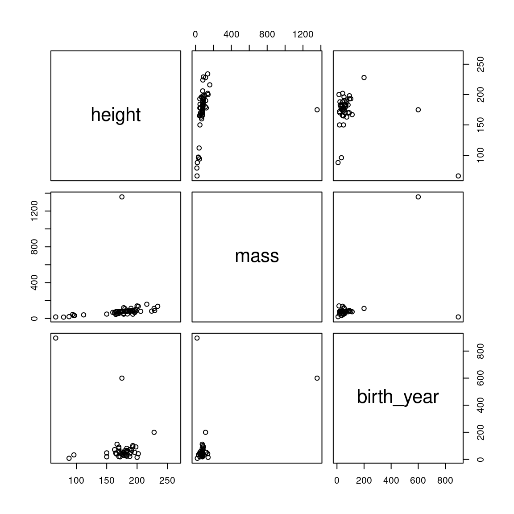
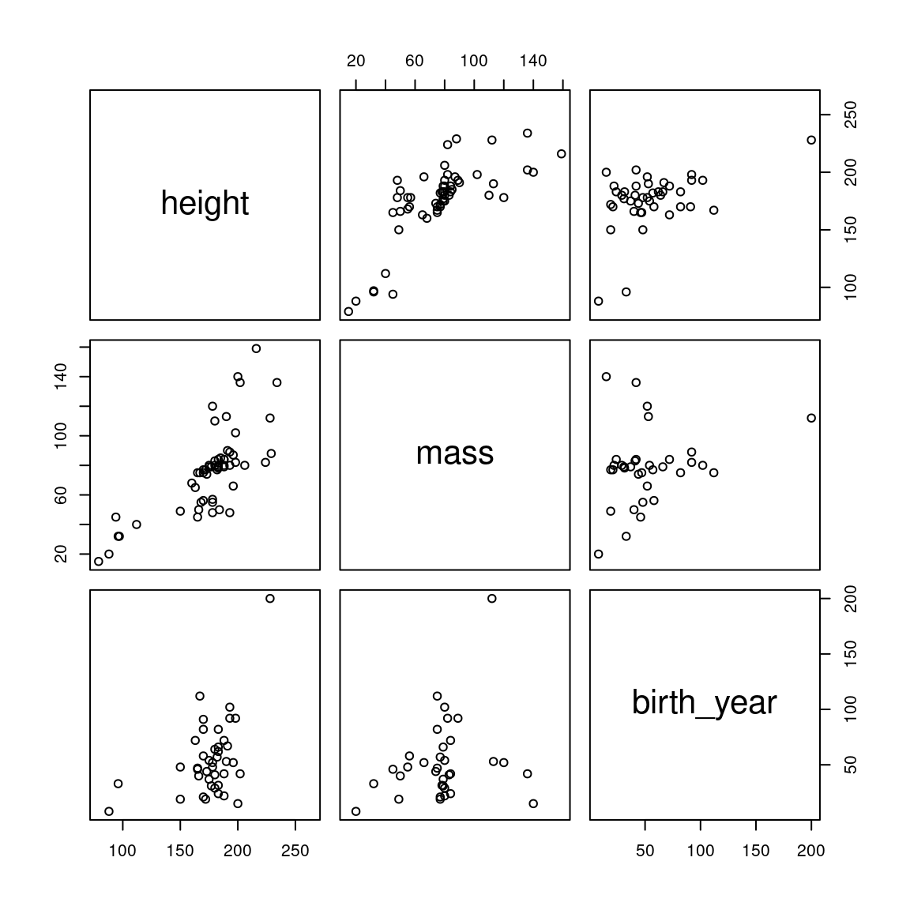
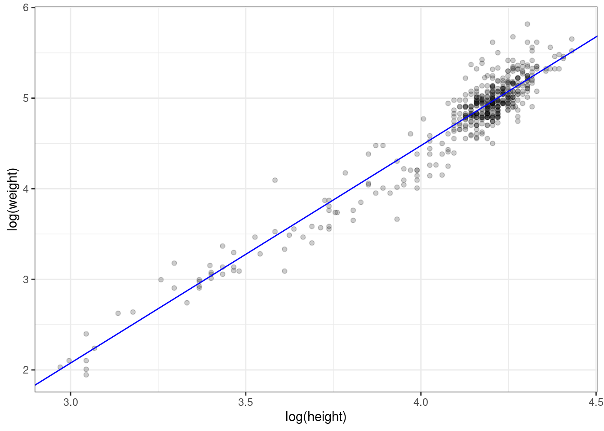

# Understanding correlation and regression through bivariate simulation

* Packages used: 
    + **`tidyverse`**
    + **`corrr`**
    + **`MASS`** (built in)
* Functions used: 
    + `base::choose()` 
    + `corrr::correlate()`
    + `base::rbind()`
    + `base::cor()`
    + `base::log()` and `base::exp()` for log transformation (and back)

* Review 
    + [L2 lab materials on correlation](https://psyteachr.github.io/ug2-practical/correlations.html){target="_blank"}.

## Correlation matrices

You may be familiar with the concept of a **correlation matrix** from reading papers in psychology. Correlation matrices are a common way of summarizing relationships between multiple measurements taken from the same individual.

Let's say you've measured psychological well-being using multiple scales. One question is the extent to which these scales are measuring the same thing. Often you will look at a correlation matrix to explore all the pairwise relationships between measures.

Recall that a correlation coefficient quantifies the **strength** and **direction** of a relationship between two variables. It is usually represented by the symbol $r$ or $\rho$ (Greek letter "rho").  The correlation coefficient ranges between -1 and 1, with 0 corresponding to no relationship, positive values reflecting a positive relationship (as one variable increases, so does the other), and negative values reflecting a negative relationship (as one variable increases, the other decreases).

<div class="figure" style="text-align: center">

<p class="caption">(\#fig:correlation-relationships)Different types of bivariate relationships.</p>
</div>

If you have $n$ measures, how many pairwise correlations can you compute? You can figure this out either by the formula in the info box below, or more easily you can computed it directly through the `choose(n, 2)` function in R. For instance, to get the number of possible pairwise correlations between 6 measures, you'd type `choose(6, 2)`, which tells you that you have 15 combinations.

<div class="info">
<p>For any <span class="math inline">\(n\)</span> measures, you can calculate <span class="math inline">\(\frac{n!}{2(n - 2)!}\)</span> pairwise correlations between measures. The <span class="math inline">\(!\)</span> symbol is called the <strong>factorial</strong> operator, defined as the product of all numbers from 1 to <span class="math inline">\(n\)</span>. So, if you have six measurements, you have</p>
<p><span class="math display">\[
\frac{6!}{2(6-2)!} = \frac{1 \times 2 \times 3 \times 4 \times 5 \times 6}{2\left(1 \times 2 \times 3 \times 4\right)} = \frac{720}{2(24)} = 15
\]</span></p>
</div>

You can create a correlation matrix in R using `base::cor()` or `corrr::correlate()`. We prefer the latter function because `cor()` requires that your data is stored in a matrix, whereas most of the data we will be working with is tabular data stored in a data frame. The `corrr::correlate()` function takes a data frame as the first argument, and provides "tidy" output, so it integrates better with tidyverse functions and pipes (`%>%`).

Let's create a correlation matrix to see how it works. Start by loading in the packages we will need.


```r
library("tidyverse")
library("corrr")  # install.packages("corrr") in console if missing
```

We will use the `starwars` dataset, which is a built-in dataset that becomes available after you load the tidyverse package. This dataset has information about various characters that have appeared in the Star Wars film series. Let's look at the correlation between 


```r
starwars %>%
  select(height, mass, birth_year) %>%
  correlate()
```

```
## 
## Correlation method: 'pearson'
## Missing treated using: 'pairwise.complete.obs'
```

```
## # A tibble: 3 x 4
##   rowname    height   mass birth_year
##   <chr>       <dbl>  <dbl>      <dbl>
## 1 height     NA      0.134     -0.400
## 2 mass        0.134 NA          0.478
## 3 birth_year -0.400  0.478     NA
```

You can look up any bivariate correlation at the intersection of any given row or column. So the correlation between `height` and `mass` is .134, which you can find in row 1, column 2 or row 2, column 1; the values are the same. Note that there are only `choose(3, 2)` = 3 unique bivariate relationships, but each appears twice in the table. We might want to show only the unique pairs. We can do this by appending `corrr::shave()` to our pipeline.


```r
starwars %>%
  select(height, mass, birth_year) %>%
  correlate() %>%
  shave()
```

```
## 
## Correlation method: 'pearson'
## Missing treated using: 'pairwise.complete.obs'
```

```
## # A tibble: 3 x 4
##   rowname    height   mass birth_year
##   <chr>       <dbl>  <dbl>      <dbl>
## 1 height     NA     NA             NA
## 2 mass        0.134 NA             NA
## 3 birth_year -0.400  0.478         NA
```

Now we've only got the lower triangle of the correlation matrix, but the `NA` values are ugly and so are the leading zeroes. The **`corrr`** package also provides the `fashion()` function that cleans things up (see `?corrr::fashion` for more options).


```r
starwars %>%
  select(height, mass, birth_year) %>%
  correlate() %>%
  shave() %>%
  fashion()
```

```
## 
## Correlation method: 'pearson'
## Missing treated using: 'pairwise.complete.obs'
```

```
##      rowname height mass birth_year
## 1     height                       
## 2       mass    .13                
## 3 birth_year   -.40  .48
```

Correlations only provide a good description of the relationship if the relationship is (roughly) linear and there aren't severe outliers that are wielding too strong of an influence on the results. So it is always a good idea to visualize the correlations as well as to quantify them.  The `base::pairs()` function does this. The first argument to `pairs()` is simply of the form `~ v1 + v2 + v3 + ... + vn` where `v1`, `v2`, etc. are the names of the variables you want to correlate.


```r
pairs(~ height + mass + birth_year, starwars)
```

<div class="figure" style="text-align: center">

<p class="caption">(\#fig:pairs)Pairwise correlations for the starwars dataset</p>
</div>

We can see that there is a big outlier influencing our data; in particular, there is a creature with a mass greater than 1200kg! Let's find out who this is and eliminate them from the dataset.


```r
starwars %>%
  filter(mass > 1200) %>%
  select(name, mass, height, birth_year)
```

```
## # A tibble: 1 x 4
##   name                   mass height birth_year
##   <chr>                 <dbl>  <int>      <dbl>
## 1 Jabba Desilijic Tiure  1358    175        600
```

OK, let's see how the data look without this massive creature.


```r
starwars2 <- starwars %>%
  filter(name != "Jabba Desilijic Tiure")

pairs(~height + mass + birth_year, starwars2)
```

<div class="figure" style="text-align: center">

<p class="caption">(\#fig:massive-creature)Pairwise correlations for the starwars dataset after removing outlying mass value.</p>
</div>

Better, but there's a creature with an outlying birth year that we might want to get rid of.


```r
starwars2 %>%
  filter(birth_year > 800) %>%
  select(name, height, mass, birth_year)
```

```
## # A tibble: 1 x 4
##   name  height  mass birth_year
##   <chr>  <int> <dbl>      <dbl>
## 1 Yoda      66    17        896
```

It's Yoda. He's as old as the universe. Let's drop him and see how the plots look.


```r
starwars3 <- starwars2 %>%
  filter(name != "Yoda")

pairs(~height + mass + birth_year, starwars3)
```

<div class="figure" style="text-align: center">

<p class="caption">(\#fig:bye-yoda)Pairwise correlations for the starwars dataset after removing outlying mass and birth\_year values.</p>
</div>

That looks much better. Let's see how that changes our correlation matrix.


```r
starwars3 %>%
  select(height, mass, birth_year) %>%
  correlate() %>%
  shave() %>%
  fashion()
```

```
## 
## Correlation method: 'pearson'
## Missing treated using: 'pairwise.complete.obs'
```

```
##      rowname height mass birth_year
## 1     height                       
## 2       mass    .74                
## 3 birth_year    .45  .24
```

Note that these values are quite different from the ones we started with.

Sometimes it's not a great idea to remove outliers. Another approach to dealing with outliers is to use a robust method. The default correlation coefficient that is computed by `corrr::correlate()` is the Pearson product-moment correlation coefficient. You can also compute the Spearman correlation coefficient by changing the `method()` argument to `correlate()`. This replaces the values with ranks before computing the correlation, so that outliers will still be included, but will have dramatically less influence.


```r
starwars %>%
  select(height, mass, birth_year) %>%
  correlate(method = "spearman") %>%
  shave() %>%
  fashion()
```

```
## 
## Correlation method: 'spearman'
## Missing treated using: 'pairwise.complete.obs'
```

```
##      rowname height mass birth_year
## 1     height                       
## 2       mass    .75                
## 3 birth_year    .16  .15
```

Incidentally, if you are generating a report from R Markdown and want your tables to be nicely formatted you can use `knitr::kable()`.


```r
starwars %>%
  select(height, mass, birth_year) %>%
  correlate(method = "spearman") %>%
  shave() %>%
  fashion() %>%
  knitr::kable()
```


|rowname    |height |mass |birth_year |
|:----------|:------|:----|:----------|
|height     |       |     |           |
|mass       |.75    |     |           |
|birth_year |.16    |.15  |           |

## Simulating bivariate data

You have already learned how to simulate data from the normal distribution using the function `rnorm()`. Recall that `rnorm()` allows you to specify the mean and standard deviation of a single variable. How do we simulate correlated variables?

It should be clear that you can't just run `rnorm()` twice and combine the variables, because then you end up with two variables that are unrelated, i.e., with a correlation of zero.

The package **`MASS`** provides a function `mvrnorm()` which is the 'multivariate' version of rnorm (hence the function name, `mv` + `rnorm`, which makes it easy to remember.

<div class="watchout">
<p>The <strong><code>MASS</code></strong> package comes pre-installed with R. But the only function you’ll probably ever want to use from <strong><code>MASS</code></strong> is <code>mvrnorm()</code>, so rather than load in the package using <code>library("MASS")</code>, it is preferable to use <code>MASS::mvrnorm()</code>, especially as <strong><code>MASS</code></strong> and the <strong><code>dplyr</code></strong> package from <strong><code>tidyverse</code></strong> don’t play well together, due to both packages having the function <code>select()</code>. So if you load in <strong><code>MASS</code></strong> after you load in <strong><code>tidyverse</code></strong>, you’ll end up getting the <strong><code>MASS</code></strong> version of <code>select()</code> instead of the <strong><code>dplyr</code></strong> version. It will do your head in trying to figure out what is wrong with your code, so always use <code>MASS::mvrnorm()</code> without loading <code>library("MASS")</code>.</p>
<blockquote class="twitter-tweet">
<p lang="en" dir="ltr">
MASS before dplyr, clashes not dire;<br>dplyr before MASS, pain in the ass. <a href="https://twitter.com/hashtag/rstats?src=hash&amp;ref_src=twsrc%5Etfw">#rstats</a> <a href="http://t.co/vHIbGwSKd8">pic.twitter.com/vHIbGwSKd8</a>
</p>
— Dale Barr (<span class="citation">@dalejbarr</span>) <a href="https://twitter.com/dalejbarr/status/516986671129452544?ref_src=twsrc%5Etfw">September 30, 2014</a>
</blockquote>
<script async src="https://platform.twitter.com/widgets.js" charset="utf-8"></script>
</div>

Have a look at the documentation for the `mvrnorm()` function (type `?MASS::mvrnorm` in the console).

There are three arguments to take note of:

|arg   |description                                                                            |
|:-----|:--------------------------------------------------------------------------------------|
|n     |the number of samples required                                                         |
|mu    |a vector giving the means of the variables                                             |
|Sigma |a positive-definite symmetric matrix specifying the covariance matrix of the variables. |

The descriptions for `n` and `mu` are understandable, but what is a "positive-definite symmetric matrix specifying the covariance"?

When you have multivariate data, the **covariance matrix** (also known as the **variance-covariance** matrix) specifies the variances of the individual variables and their interrelationships. It is like a multidimensional version of the **standard deviation**. To fully describe a univariate normal distribution, you need to know only the mean and standard deviation; to describe a bivariate normal distribution, you need the means of each of the two variables, their standard deviations, and their correlation; for a multivariate distribution with more the two variables you need the means for all of the variables, their standard deviations, and all of the possible pairwise correlations. **These concepts become very important once we start talking about mixed-effects modelling.**

You can think of a covariance matrix as something like the correlation matrix that you saw above; indeed, with a few calculations you can turn a covariance matrix into a correlation matrix.

<div class="info">

What's all this talk about the Matrix? Wasn't that a sci-fi film series from the 1990s?

In mathematics, matrices are just generalizations of the concept of a vector: a vector can be thought of as having one dimension, whereas a matrix can have any number of dimensions.

So the matrix

$$
\begin{pmatrix}
1 & 4 & 7 \\
2 & 5 & 8 \\
3 & 6 & 9 \\
\end{pmatrix}
$$

is a 3 (row) by 3 (column) matrix containing the column vectors $\begin{pmatrix} 1 \\ 2 \\ 3 \\ \end{pmatrix}$, $\begin{pmatrix} 4 \\ 5 \\ 6 \\ \end{pmatrix}$, and $\begin{pmatrix} 7 \\ 8 \\ 9 \\ \end{pmatrix}$. Conventionally, we refer to matrices in $i$ by $j$ format, with $i$ being the number of rows and $j$ being the number of columns.  So a 3x2 matrix has 3 rows and 2 columns, like so.

$$
\begin{pmatrix}
a & d \\
b & e \\
c & f \\
\end{pmatrix}
$$

A **square matrix** is a matrix where the number of rows is equal to the number of columns.

You can create the above matrix in R using the `matrix()` function (see below) or by binding together vectors using the base R `cbind()` and `rbind()`, which bind vectors together column-wise and row-wise, respectively. Try `cbind(1:3, 4:6, 7:9)` in your console.

</div>

Now what is all this about the matrix being "positive-definite" and "symmetric"? These are mathematical requirements about the kinds of matrices that can represent possible multivariate normal distributions. In other words, the covariance matrix you supply must be represent a legal multivariate normal distribution. At this point, you don't really need to know much more about this than that.

<iframe src="https://dalejbarr.github.io/bivariate/index.html" width="420" height="620" style="border: none;"></iframe>

Let's start by simulating data representing hypothetical humans and their heights and weights. We know these things are correlated. What we need to be able to simulate data are means and standard deviations for these two variables and their correlation.

I found some data [here](https://www.geogebra.org/m/RRprACv4) which I converted into a CSV file. If you want to follow along, download the file [heights_and_weights.csv](data/heights_and_weights.csv){download="heights_and_weights.csv"}. Here's how the scatterplot looks:


```r
handw <- read_csv("data/heights_and_weights.csv", col_types = "dd")

ggplot(handw, aes(height_in, weight_lbs)) + 
  geom_point(alpha = .2) +
  labs(x = "height (inches)", y = "weight (pounds)") 
```

<div class="figure" style="text-align: center">

<p class="caption">(\#fig:heights-and-weights)Heights and weights of 475 humans (including infants)</p>
</div>

Now, that's not quite a linear relationship. We can make it into one by log transforming each of the variables first.


```r
handw_log <- handw %>%
  mutate(hlog = log(height_in),
         wlog = log(weight_lbs))
```


<div class="figure" style="text-align: center">

<p class="caption">(\#fig:handw-log)Log transformed heights and weights.</p>
</div>

The fact that there is a big cluster of points in the top right tail of the cloud probably indicates that there were more adults than kids in this sample, since adults are taller and heavier.

The mean log height is 4.11 (SD = 0.26), while the mean log weight is 4.74 (SD = 0.65).  The correlation between log height and log weight, which we can get using the `cor()` function, is very high, 0.96.

We now have all the information we need to simulate the heights and weights of, let's say, 500 humans. But how do we get this information into `MASS::mvrnorm()`? We know the first part of the function call will be `MASS::mvrnorm(500, c(4.11, 4.74), ...)`, but what about `Sigma`, the covariance matrix?  We know from above that $\hat{\sigma}_x = 0.26$ and $\hat{\sigma}_y = 0.65$,  and $\hat{\rho}_{xy} = 0.96$.

A covariance matrix representating `Sigma` ($\mathbf{\Sigma}$) for bivariate data has the following format:

$$
\mathbf{\Sigma} =
\begin{pmatrix}
{\sigma_x}^2                & \rho_{xy} \sigma_x \sigma_y \\
\rho_{yx} \sigma_y \sigma_x & {\sigma_y}^2 \\
\end{pmatrix}
$$

The variances (squared standard deviations, ${\sigma_x}^2$ and ${\sigma_y}^2$) are in the diagonal, and the covariances (the correlation times the two standard deviations, $\rho_{xy} \sigma_x \sigma_y$) are in the off-diagonal. It is useful to remember that the covariance is just the correlation times the product of the two standard deviations. As we saw above with the correlation matrices, there is redundant information in the table; namely, the covariance appears in the top right cell as well as the bottom left cell of the matrix.

So plugging in the values we got above, our covariance matrix should be

$$
\begin{pmatrix}
.26^2 & (.96)(.26)(.65) \\
(.96)(.65)(.26) & .65^2 \\
\end{pmatrix} =
\begin{pmatrix}
.067 & .162 \\
.162 & .423 \\
\end{pmatrix}
$$

OK, how do we form `Sigma` in R so that we can pass it to the `mvrnorm()` function? We will use the `matrix()` function, as shown below.

First let's define our covariance and store it in the variable `my_cov`.


```r
my_cov <- .96 * .26 * .65
```

Now we'll use `matrix()` to define our `Sigma`, `my_Sigma`.


```r
my_Sigma <- matrix(c(.26^2, my_cov, my_cov, .65^2), ncol = 2)
my_Sigma
```

```
##         [,1]    [,2]
## [1,] 0.06760 0.16224
## [2,] 0.16224 0.42250
```

<div class="info">
<p>Confused about the <code>matrix()</code> function?</p>
<p>The first argument is a vector of values, which we created above using <code>c()</code>. The <code>ncol</code> argument specifies how many columns the matrix should have. There is also an <code>nrow</code> argument that you could use, but if you give it one of the dimensions, it can infer the size of the other using the length of the vector supplied as the first argument.</p>
<p>You can see that <code>matrix()</code> fills in the elements of the matrix column by column, rather than row by row by running the following code:</p>
<p><code>matrix(c("a", "b", "c", "d"), ncol = 2)</code></p>
<p>If you want to change this behavior, set the <code>byrow</code> argument to <code>TRUE</code>.</p>
<p><code>matrix(c("a", "b", "c", "d"), ncol = 2, byrow = TRUE)</code></p>
</div>

Great. Now that we've got `my_Sigma`, we're ready to use `MASS::mvrnorm()`. Let's test it out by creating 6 synthetic humans.


```r
set.seed(62) # for reproducibility

# passing the *named* vector c(height = 4.11, weight = 4.74)
# for mu gives us column names in the output
log_ht_wt <- MASS::mvrnorm(6, 
                           c(height = 4.11, weight = 4.74), 
                           my_Sigma)

log_ht_wt
```

```
##        height   weight
## [1,] 4.254209 5.282913
## [2,] 4.257828 4.895222
## [3,] 3.722376 3.759767
## [4,] 4.191287 4.764229
## [5,] 4.739967 6.185191
## [6,] 4.058105 4.806485
```

So `MASS::mvrnorm()` returns a matrix with a row for each simulated human, with the first column representing the log height and the second column representing the log weight.  But log heights and log weights are not very useful to us, so let's transform them back by using `exp()`, which is the inverse of the `log()` transform.


```r
exp(log_ht_wt)
```

```
##         height    weight
## [1,]  70.40108 196.94276
## [2,]  70.65632 133.64963
## [3,]  41.36254  42.93844
## [4,]  66.10779 117.24065
## [5,] 114.43045 485.50576
## [6,]  57.86453 122.30092
```

So our first simulated human is 70.4 inches tall (about 5'5" or X) and weighs 196.94 pounds (89.32 kg). Sounds about right! (Note also that it will generate observations outside of our original data; we'll get super tall humans, like observation 5, but at least the weight/height relationship will be preserved.)

OK, let's randomly generate a bunch of humans, transform them from log to inches and pounds, and plot them against our original data to see how we're doing.


```r
## simulate new humans
new_humans <- MASS::mvrnorm(500, 
                            c(height_in = 4.11, weight_lbs = 4.74),
                            my_Sigma) %>%
  exp() %>% # back-transform from log to inches and pounds
  as_tibble() %>% # make tibble for plotting
  mutate(type = "simulated") # tag them as simulated

## combine real and simulated datasets
## handw is variable containing data from heights_and_weights.csv
alldata <- bind_rows(handw %>% mutate(type = "real"), 
                     new_humans)

ggplot(alldata, aes(height_in, weight_lbs)) +
  geom_point(aes(colour = type), alpha = .1)
```

<div class="figure" style="text-align: center">

<p class="caption">(\#fig:plot-together)Real and simulated humans.</p>
</div>

You can see that our simulated humans are much like the normal ones, except that we are creating humans outside the normal range of heights and weights.

## Relationship between correlation and regression

OK, we know how to estimate correlations, but what if we wanted to predict the weight of someone given their height? This might sound like an impractical problem, but in fact, [emergency medical technicians can use this technique to get a quick estimate of people's weights in emergency situations](https://link.springer.com/article/10.1186/s12245-018-0212-9) where they need to administer drugs or procedures whose safety depends on the patient's weight, and don't have time to weigh them.

Recall that the GLM for a simple regression model is

$$Y_i = \beta_0 + \beta_1 X_i + e_i.$$

Here, we are trying to predict the weight ($Y_i$) of person $i$ from their observed height ($X_i$). In this equation, $\beta_0$ and $\beta_1$ are the y-intercept and slope parameters respectively, and the $e_i$s are the residuals. It is conventionally assumed that the $e_i$ values are from a normal distribution with mean of zero and variance $\sigma^2$; the math-y way of saying this is $e_i \sim N(0, \sigma^2)$, where $\sim$ is read as "distributed according to" and $N(0, \sigma^2)$ means "Normal distribution ($N$) with mean of 0 and variance of $\sigma^2$".

It turns out that if we have estimates of the means of X and Y (denoted by $\mu_x$ and $\mu_y$ respectively), of their standard deviations ($\hat{\sigma}_x$ and $\hat{\sigma}_y$), and the correlation between X and Y ($\hat{\rho}$), we have all the information we need to estimate the parameters of the regression equation $\beta_0$ and $\beta_1$. Here's how.

First, the slope of the regression line $\beta_1$ equals the correlation coefficient $\rho$ times the ratio of the standard deviations of $Y$ and $X$. 

$$\beta_1 = \rho \frac{\sigma_Y}{\sigma_X}$$

Given the estimates above for log height and weight, can you solve for $\beta_1$?

<!-- TODO make this use webex -->


```r
b1 <- .96 * (.65 / .26)
b1
```

```
## [1] 2.4
```

The next thing to note is that for mathematical reasons, the regression line is guaranteed to go through the point corresponding to the mean of $X$ and the mean of $Y$, i.e., the point $(\mu_x, \mu_y)$. (You can think of the regression line "pivoting" around that point depending on the slope). You also know that $\beta_0$ is the y-intercept, the point where the line crosses the vertical axis at $X = 0$. From this information, and the estimates above, can you figure out the value of $\beta_0$?

<!-- TODO: use webex -->

Here is the reasoning by which you can solve for $\beta_0$.

The $\beta_1$ value tells you that for each change in $X$ you have a corresponding change of 2.4 for $Y$, and you know that the line goes through the points $(\mu_x, \mu_y)$ as well as the y-intercept $(0, \beta_0)$. 

Think about stepping back unit-by-unit from $X = \mu_x$ to $X = 0$. 
At $X = \mu_x$, $Y = 4.74$. Each unit step you take backward in the X dimension, $Y$ will drop by $\beta_1 = 2.4$ units.  When you get to zero, $Y$ will have dropped from $\mu_y$ to $\mu_y - \mu_x\beta_1$.

So the general solution is: $\beta_0 = \mu_y - \mu_x\beta_1$.

Since $\beta_1 = 2.4$, $\mu_x = 4.11$, and $\mu_y = 4.74$, $\beta_0 = -5.124$. Thus, our regression equation is:

$$Y_i =  -5.124 + 2.4X_i + e_i.$$

To check our results, let's first run a regression on the log-transformed data using `lm()`, which estimates parameters using ordinary least squares regression.


```r
summary(lm(wlog ~ hlog, handw_log))
```

```
## 
## Call:
## lm(formula = wlog ~ hlog, data = handw_log)
## 
## Residuals:
##      Min       1Q   Median       3Q      Max 
## -0.63296 -0.09915 -0.01366  0.09285  0.65635 
## 
## Coefficients:
##             Estimate Std. Error t value Pr(>|t|)    
## (Intercept) -5.26977    0.13169  -40.02   <2e-16 ***
## hlog         2.43304    0.03194   76.17   <2e-16 ***
## ---
## Signif. codes:  0 '***' 0.001 '**' 0.01 '*' 0.05 '.' 0.1 ' ' 1
## 
## Residual standard error: 0.1774 on 473 degrees of freedom
## Multiple R-squared:  0.9246,	Adjusted R-squared:  0.9245 
## F-statistic:  5802 on 1 and 473 DF,  p-value: < 2.2e-16
```

Looks pretty close. The reason that it doesn't match exactly is only because we've rounded off our estimates to two decimal places for convenience. 

As another check, let's superimpose the regression line we computed by hand on the scatterplot of the log-transformed data.


```r
ggplot(handw_log, aes(hlog, wlog)) +
  geom_point(alpha = .2) +
  labs(x = "log(height)", y = "log(weight)") +
  geom_abline(intercept = -5.124, slope = 2.4, colour = 'blue')
```

<div class="figure" style="text-align: center">

<p class="caption">(\#fig:scatter-with-line)Log transformed values with superimposed regression line.</p>
</div>

Looks right.

To close, here are a few implications from the relationship between correlation and regression.

* $\beta_1 = 0$ is the same as $\rho = 0$.
* $\beta_1 > 0$ implies $\rho > 0$, since standard deviations can't be negative.
* $\beta_1 < 0$ implies $\rho < 0$, for the same reason.
* Rejecting the null hypothesis that $\beta_1 = 0$ is the same as rejecting the null hypothesis that $\rho = 0$. The p-values that you get for $\beta_1$ in `lm()` will be the same as the one you get for $\rho$ from `cor.test()`.


