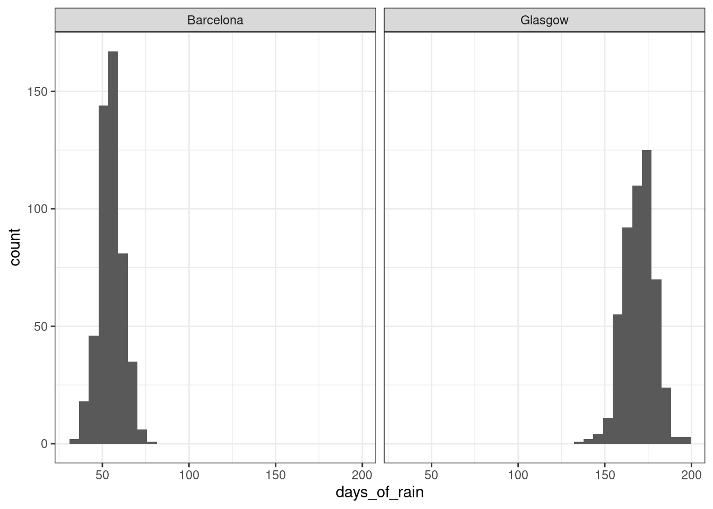

# Generalized linear mixed-effects models


## Learning objectives

* distinguish discrete from continuous data
* estimate logit models

## Discrete versus continuous data

All of the models we have been considering up to this point have assumed that the response (i.e. dependent) variable we are measuring is **continuous** and numeric. However, there are many cases in psychology where our measurements are of a **discrete** nature. By discrete, we mean that there are gaps between values, such as we would get with Likert scale data. It may also be the case that the values of the response variable reflect categories with no intrinsic ordering.  Here are some examples:

* type of linguistic structure a speaker produces (double object or prepositional object phrase)
* which of a set of images a participant is viewing at a given moment
* whether the participant has made an accurate or inaccurate selection
* whether a job candidate gets hired or not
* agreement rating on a Likert scale.

Another common type of data is **count** data, where values are also discrete. Often with count data, the number of opportunities for something to occur is not well-defined. Some examples:

* number of speech errors in a corpus
* number of turn shifts between speakers in a conversation
* number of visits to the doctor in a given month.

### Why not model discrete data as continuous?

Discrete data has some properties that generally make it a bad idea to try to analyze it using models intended for continuous data.  For instance, if you are interested in the probability of some binary event (a participant's accuracy in a forced-choice task), each measurement will be represented as a 0 or a 1, indicating an inaccurate or an accurate response, respectively. You could calculate the proportion of accurate responses for each participant and analyze that (and many people do) but that is a bad idea for a number of reasons.

#### Bounded scale

Discrete data generally has a bounded scale. It may be bounded below (as with count data, where the lower bound is zero) or it may have both an upper and lower bound, such as Likert scale data. or binary data.

#### The variance is proportional to the mean

In most settings with continuous data, the variance is assumed to be independent of the mean; this is essentially the assumption of homogeneity of variance in a model with a continuous predictor. For discrete data, this assumption of the independence of the mean from the variance is often not met. 

We can see this through data simulation. The `rbinom()` function makes it possible to simulate data from a **binomial** distribution, which describes how a collection of discrete observations behaves. Let's consider, for instance, the probability of rain on a given day in Barcelona, Spain, versus Glasgow, U.K.  According to [this website](https://www.currentresults.com/Weather/Europe/Cities/precipitation-annual-average.php), Barcelona gets an average of 55 days of rain per year, while Glasgow gets 170. So the probability of rain on a given day in Glasgow can be estimated as 170/365 or about 0.47, where as the probability for Barcelona is 55/365 or about 0.15. Let's simulate 500 years of rainfall for the two cities (assumimg the climate remains constant).


```r
rainy_days <- tibble(city = rep(c("Barcelona", "Glasgow"), each = 500),
       days_of_rain = c(rbinom(500, 365, 55/365),
                        rbinom(500, 365, 170/365))) 

rainy_days %>%
  ggplot(aes(days_of_rain)) +
  geom_histogram() +
  facet_wrap(~ city)
```

```
## `stat_bin()` using `bins = 30`. Pick better value with `binwidth`.
```

<div class="figure" style="text-align: center">

<p class="caption">(\#fig:rbinom)**Distribution of number of rainy days for 500 years of simulated rainfall in Barcelona and Glasgow**</p>
</div>

The distribution for Glasgow is slightly fatter than the distribution for Barcelona. We can also see the greater variability in Glasgow if we look at the standard deviations of these variables.


```r
rainy_days %>%
  group_by(city) %>%
  summarise(sd = sd(days_of_rain))
```

```
## # A tibble: 2 x 2
##   city         sd
##   <chr>     <dbl>
## 1 Barcelona  6.99
## 2 Glasgow    9.56
```


#### Spurious interactions due to scaling effects

Another reason why treating discrete data as continuous can be problematic is the bounded nature of many discrete scales, which can lead to the detection of spurious interaction effects. For instance, consider the effect of some experimental intervention that increases accuracy. If participants are already highly accurate (e.g., more than 90%) in condition A than in condition B (say, 50%) then the size of the possible effect in A is smaller than the size of the possible effect in B, since accuracy cannot exceed 100%. Thus, it is difficult to know whether any interaction effect reflects something theoretically meaningful, or just an artifact of the bounded nature of the scale.

## Generalized Linear Models

The basic idea behind Generalized Linear Models (not to be confused with General Linear Models) is to specify a **link function** that transforms the response space into a modeling space where we can perform our usual linear regression, and to capture the dependence of the variance on the mean through a **variance function**.  The parameters of the model will be expressed on the scale of the modeling space, but we can always transform it back into our original response space using the **inverse link function**.

There are a large variety of different kinds of generalized linear models you can fit to different types of data. The ones most commonly used in psychology are **logistic regression** and **Poisson regression**, the former being used for binary data (Bernoulli trials) and the latter being used for count data, where the number of trials is not well-defined. We will be focusing on logistic regression.

## Logistic regression

### Terminology

<table>
 <thead>
  <tr>
   <th style="text-align:left;"> Term </th>
   <th style="text-align:left;"> Definition </th>
  </tr>
 </thead>
<tbody>
  <tr>
   <td style="text-align:left;"> **Bernoulli trial** </td>
   <td style="text-align:left;"> An event with a binary outcome, with one outcome considered 'success' </td>
  </tr>
  <tr>
   <td style="text-align:left;"> **proportion** </td>
   <td style="text-align:left;"> The ratio of successes to the total number of Bernoulli trials </td>
  </tr>
  <tr>
   <td style="text-align:left;"> **odds** </td>
   <td style="text-align:left;"> The ratio of successes to failures </td>
  </tr>
  <tr>
   <td style="text-align:left;"> **log odds** </td>
   <td style="text-align:left;"> The (natural) log of the odds </td>
  </tr>
</tbody>
</table>

In logistic regression, we are modeling the relationship between the response and a set of predictors in log odds space.

Logistic regression is used when the individual outcomes are Bernoulli trials---events with binary outcomes. Typically one of the two outcomes is referred to as 'success' and is coded as a 1; the other is referred to as 'failure' and is coded as 0. Note that the terms 'success' and 'failure' are completely arbitrary, and should not be taken to imply that the more desireable category should always be coded as 1.  For instance, when flipping a coin we could equivalently choose 'heads' as success and 'tails' as failure or vice-versa.

Often the outcome of a sequence of Bernoulli trials is communicated as a **proportion**---the ratio of successes to the total number of trials. For instance, if we flip a coin 100 times and get 47 heads, we would have a proportion of 47/100 or .47, which would also be our estimate of the probability of the event. For events coded as 1s and 0s, a shortcut way of getting the proportion is to use the `mean()` function.

We can also talk about the odds of success, i.e., that the odds of heads versus tails are one to one, or 1:1. The odds of it raining on a given day in Glasgow would be 170:195; the denominator is the number of days it did not rain (365 - 170 = 195).  Expressed as a decimal number, the ratio 170/195 is about 0.87, and is known as the **natural odds**. Natural odds ranges from 0 to $+\inf$.  Given $Y$ successes on $N$ trials, we can represent the natural odds as $\frac{Y}{N - Y}$.  Or, given a probability $p$, we can represent the odds as $\frac{p}{1-p}$.

The natural log of the odds, or **logit** is scale on which logistic regression is performed. Recall that the logarithm of some value $Y$ gives the exponent that would yield $Y$ for a given base. For instance, the $log_2$ (log to the base 2) of 16 is 4, because $2^4 = 16$. In logistic regression, the base that is typically used is $e$ (also known as Euler's number).  To get the log odds from odds of, say, Glasgow rainfall, we would use `log(170/195)`, which yields -0.1372011; to get natural odds back from log odds, we would use the inverse, `exp(-.137)`, which returns about 0.872.

### Properties of log odds

log odds = $\log \left(\frac{p}{1-p}\right)$

Log odds has some nice properties for linear modeling.

First, it is symmetric around zero, and zero log odds corresponds to maximum uncertainty, i.e., a probability of .5. Positive log odds means that success is more likely than failure (Pr(success) > .5), and negative log odds means that failure is more likely than success (Pr(success) < .5). A log odds of 2 means that success is more likely than failure by the same amount that -2 means that failure is more likely than success. The scale is unbounded; it goes from $-\infty$ to $+\infty$. 

### Link and variance functions

The link function for logistic regression is:

$$\eta = \log \left(\frac{p}{1-p}\right)$$

while the inverse link function is:

$$p = \frac{1}{1 + e^{-\eta}}$$

where $e$ is Euler's number. In R, you could type this latter function as `1/(1 + exp(-eta))`.

The variance function is the variance for the binomial distribution, namely:

$$np(1 - p)$$.

The app below allows you to manipulate the intercept and slope of a line in log odds space and to see the projection of the line back into response space. Note the S-shaped ("sigmoidal") shape of the function in the response shape.

<div class="figure" style="text-align: center">
<iframe src="https://shiny.psy.gla.ac.uk/Dale/logit?showcase=0" width="100%" height="500px"></iframe>
<p class="caption">(\#fig:logit-app)**Logistic regression web app** <https://shiny.psy.gla.ac.uk/Dale/logit></p>
</div>

### Estimating logistic regression models in R

For single-level data, you use the `glm()` function. Note that it is much like the `lm()` function you are already familiar with. The main difference is that you specify a `family` argument for the link/variance functions. For logistic regression, you use `family = binomial(link = "logit")`. The logit link is default for the binomial family with a logit link, so typing `family = binomial` is sufficient.

`glm(DV ~ IV1 + IV2 + ..., data, family = binomial)`

For multi-level data where there are random effects to be modeled, you use the `glmer` function from `lme4`:

`glmer(DV ~ IV1 + IV2 + ... (1 | subject), data, family = binomial)`
