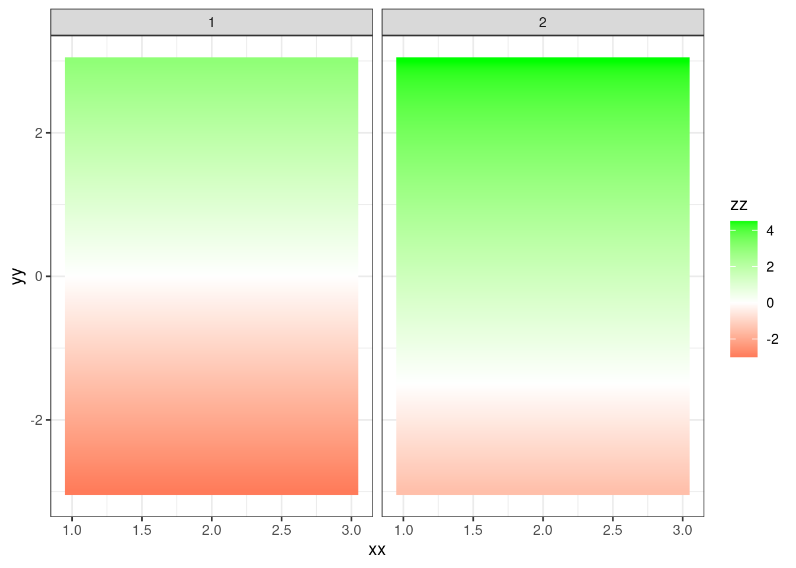

# Modeling Ordinal Data

It is perhaps easiest to think about ordinal data by viewing it as a more general case of logistic regression. In logistic regression, the response variable $Y$ has two categories (e.g., 0, 1), with the model intercept representing the point in log odds space where 0 and 1 are equiprobable.

$$\eta = \beta_0 + \beta_1 X_i$$


```r
xx <- rep(seq(1, 3, by = .1))
x2 <- xx + 3
yy <- rep(seq(-3, 3, by = .1))

ras <- bind_rows(crossing(xx, yy) %>%
                 mutate(zz = yy, cat = 1L),
                 crossing(xx, yy) %>%
                 mutate(zz = yy + 1.5, cat = 2L))
          
ggplot(ras, aes(xx, yy)) +
  geom_raster(aes(fill = zz), interpolate = TRUE) +
  scale_fill_gradient2(high = "green", low = "red") +
  facet_wrap(~cat)
```

<div class="figure" style="text-align: center">

<p class="caption">(\#fig:start)TODO</p>
</div>
