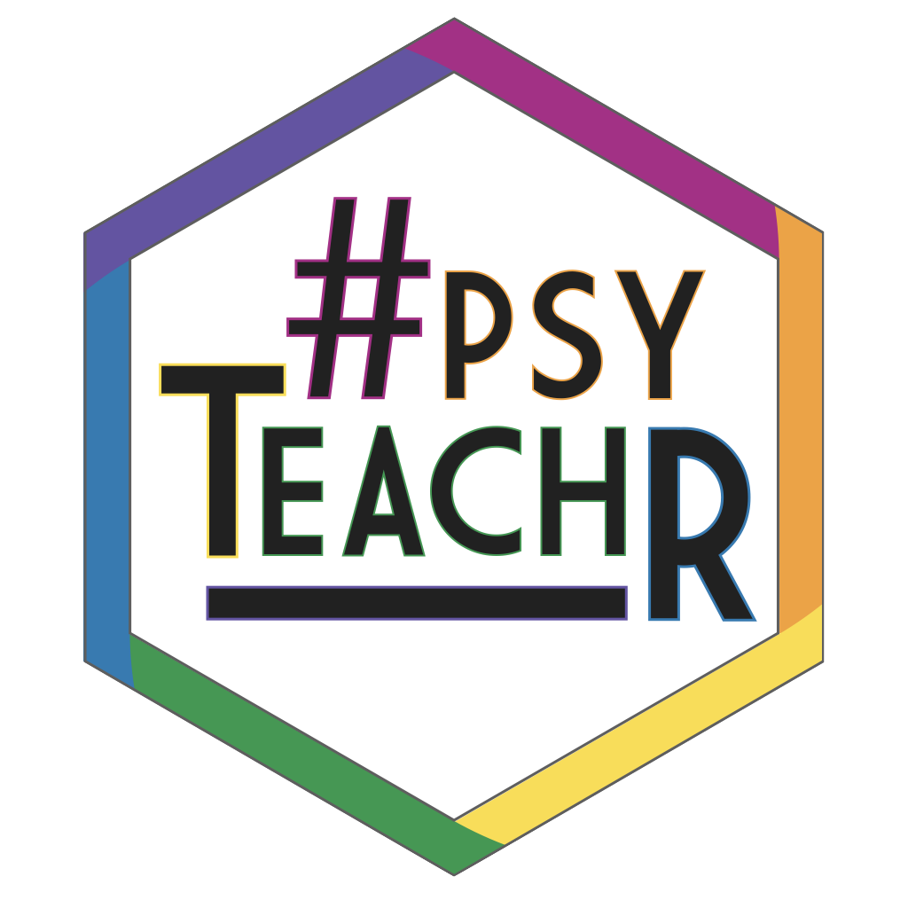

--- 
title: "Learning Statistical Models Through Simulation in R"
author: "Dale J. Barr"
date: "`r Sys.Date()`"
site: bookdown::bookdown_site
documentclass: book
bibliography: [book.bib, packages.bib]
biblio-style: apa
csl: include/apa.csl
link-citations: yes
description: "Textbook on statistical models for social scientists."
url: "https://psyteachr.github.io/stat-models-v1"
github-repo: "psyteachr/stat-models-v1"
cover-image: "images/logos/logo.png"
apple-touch-icon: "images/logos/apple-touch-icon.png"
apple-touch-icon-size: 180
favicon: "images/logos/favicon.ico"
---

```{r cite-packages, include = FALSE}
# automatically create a bib database for R packages
# add any packages you want to cite here
knitr::write_bib(c(
  .packages(), 'bookdown', 'tidyverse', 'kableExtra'
), 'packages.bib')

```

# Overview {-}

This textbook approaches statistical analysis through the General Linear Model, taking a simulation-based approach in the R software environment. The overarching goal is to teach students how to translate a description of the design of a study into a linear model to analyze data from that study. The focus is on the skills needed to analyze data from psychology experiments.

<div class="small_right"></div>

The following topics are covered:

* linear modeling workflow;
* variance-covariance matrices;
* multiple regression;
* interactions (continuous-by-categorical; categorical-by-categorical);
* linear mixed-effects regression;
* generalized linear mixed-effects regression.

The material in this course forms the basis for a one-semester course for third-year undergradautes taught by [Dale Barr]() at the [University of Glasgow School of Psychology](). It is part of the [PsyTeachR series of course materials](https://psyteachr.github.io) developed by University of Glasgow Psychology staff. 

Unlike other textbooks you may have encountered, this is an **interactive textbook**. Each chapter contains embedded exercises as well as web applications to help students better understand the content. The interactive content will only work if you access this material through a web browser. Printing out the material is not recommended. If you want to access the textbook without an internet connection or have a local version to keep in case this site changes or moves, you can [download a version for offline use](offline-textbook.zip). Just extract the files from the ZIP archive, locate the file `index.html` in the `docs` directory, and open this file using a web browser.

## How to cite this book {-}

Barr, Dale J. (2021). *Learning statistical models through simulation in R: An interactive textbook*. Version 1.0.0. Retrieved from <https://psyteachr.github.io/stat-models-v1>.

## Found an issue? {-}

If you find errors or typos, have questions or suggestions, please file an issue at <https://github.com/psyteachr/stat-models-v1/issues>. Thanks!

## Information for educators {-}

You are free to re-use and modify the material in this textbook for your own purposes, with the stipulation that you cite the original work. Please note additional terms of the [Creative Commons CC-BY-SA 4.0 license](https://creativecommons.org/licenses/by-sa/4.0/) governing re-use of this material.

The book was built using the R [**`bookdown`**](https://bookdown.org) package. The source files are available at [github](https://github.com/psyteachr/stat-models-v1).
